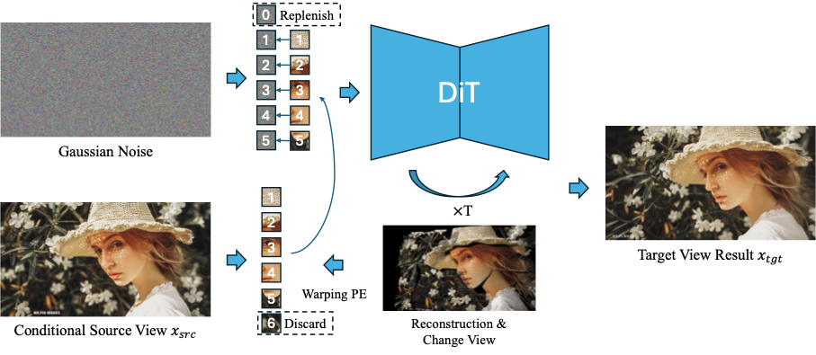
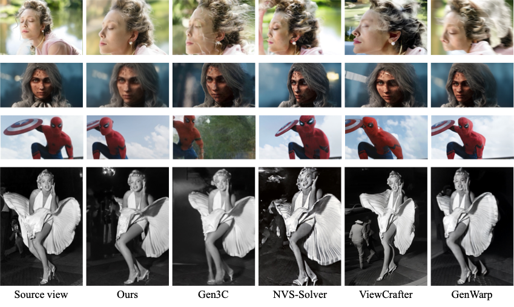

# Positional Encoding Field (PE-Field)

We introduce the **Positional Encoding Field (PE-Field)**, which extends positional encodings from the 2D plane to a structured 3D field. PE-Field incorporates **depth-aware encodings** for volumetric reasoning and **hierarchical encodings** for fine-grained sub-patch control, enabling DiTs to model geometry directly in 3D space. Our PE-Field–augmented DiT achieves **state-of-the-art performance** on single-image novel view synthesis and generalizes to **controllable spatial image editing**.

<p align="center">
  
</p>

---

## TODO List

- [ ] Release training codes  
- [ ] Support Spatial Image Editing
- [ ] Support Image-to-Video models (e.g., Wan)  
- [ ] Support Qwen-Image  
- [x] Support multi-step transformation  
- [x] Support FLUX-Kontext  

---

## Environment Setup

To create a Python environment named **pe_field** under the `./envs` directory and install all dependencies from `requirements.txt`, run:

```bash
# Create virtual environment
python3 -m venv ./envs/pe_field

# Activate environment
source ./envs/pe_field/bin/activate

# Install dependencies
pip install -r requirements.txt
````

---

## Preparation

1. Download **FLUX.1-Kontext** (except transformer) from
   [black-forest-labs/FLUX.1-Kontext-dev](https://huggingface.co/black-forest-labs/FLUX.1-Kontext-dev)
   and place it under:

   ```
   ./FLUX.1-Kontext-dev
   ```

2. Download **MoGe weights** from
   [Ruicheng/moge-2-vitl-normal](https://huggingface.co/Ruicheng/moge-2-vitl-normal)
   and place it under:

   ```
   ./moge-2-vitl-normal/model.pt
   ```

3. Download our **Transformer weights** from
   [PE-Field/FLUX.1-Kontext-dev](https://huggingface.co/yunpeng1998/PE-Field/tree/main/FLUX.1-Kontext-dev/transformer)
   and place them under:

   ```
   ./checkpoints/transformer
   ```

---

## Inference

You can run inference with either a single image path or a directory containing multiple images.
`--phi` and `--theta` are two parameters used to adjust the azimuth angle and the elevation angle, respectively.


```bash
python ./infer_viewchanger_single_v2.py \
  --moge_checkpoint_path "./moge-2-vitl-normal/model.pt" \
  --transformer_checkpoint_path "./checkpoints" \
  --flux_kontext_path "./FLUX.1-Kontext-dev" \
  --input_image "image_path_or_dir" \
  --output_dir "outputs" \
  --phi -5 --theta 5
```

---

## Results

<p align="center">
  
</p>

<p align="center">
  
</p>

---

## Citation

If you find our work useful in your research, we gratefully request that you consider citing our paper:

```bibtex
@article{your2025pefield,
  title   = {Positional Encoding Field},
  author  = {Your Name and Others},
  journal = {arXiv preprint arXiv:2501.xxxxx},
  year    = {2025}
}
```


